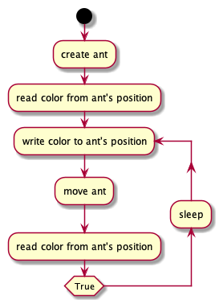
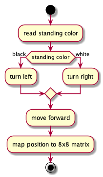
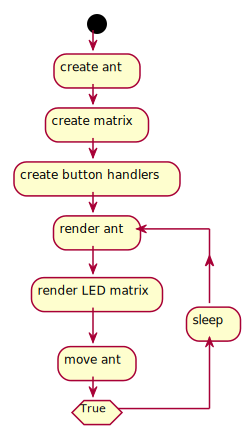
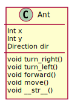

# LangtonsAntSenseHAT
Langton's ant implementation written in Python. Requires SenseHAT on Raspberry Pi.

Joystick actions:
Up - reset LED matrix
Right / Left - control speed
Down - change ant color

## Activity diagram - main loop (old version)

## Activity diagram - ant's move method

## Activity diagram - main loop

## Ant’s class diagram

[Langton's ant wikipedia page](https://en.wikipedia.org/wiki/Langton%27s_ant)
